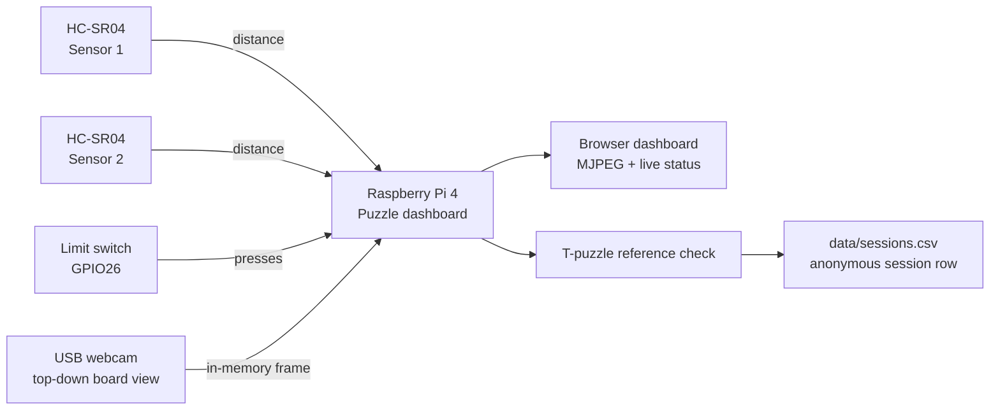
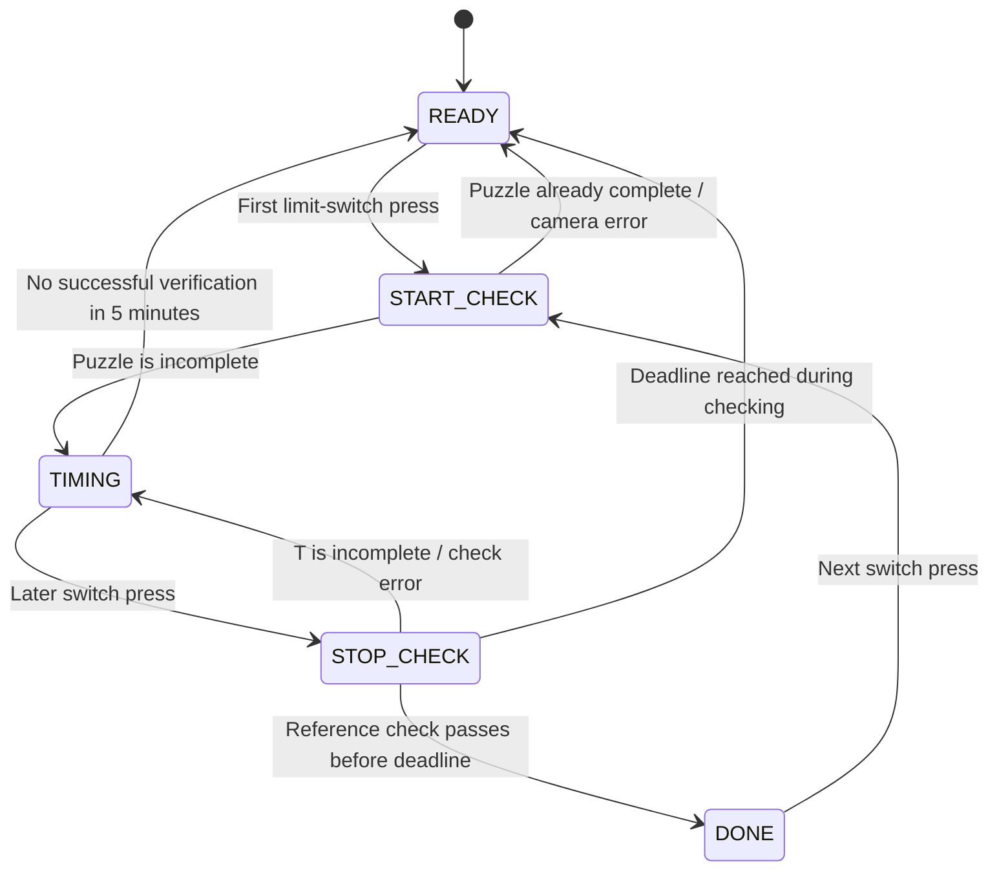
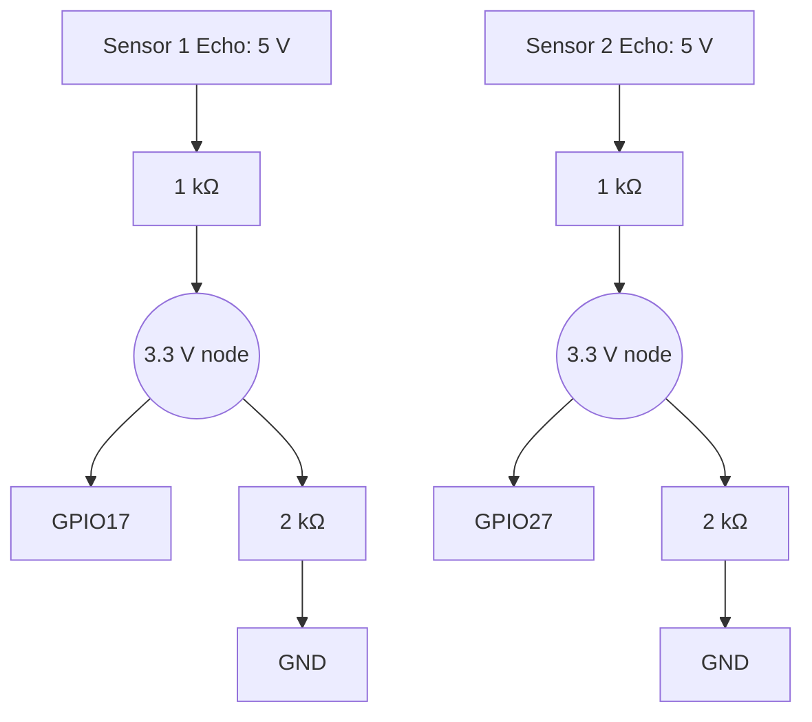

# Puzzle Telemetry Rig

An offline Raspberry Pi system for measuring how visitors solve a physical T-puzzle. It detects an approach, starts and stops a stopwatch with one limit switch, verifies the completed shape from a top-down webcam, and writes anonymous session metrics to CSV.

> The rig serves a live local dashboard but does not record video or per-session photos.

## System at a glance



## Session flow



At the five-minute deadline, the session is saved with `completed=abandoned`. A reference check must finish before the deadline to save `completed=yes`.

## Current wiring

| Component | Pi physical pin | BCM GPIO | Notes |
|---|---:|---:|---|
| Sensor 1 VCC / GND | 2 / 6 | — | 5 V / GND |
| Sensor 1 Trigger | 15 | GPIO22 | Pi to sensor |
| Sensor 1 Echo | 11 | GPIO17 | Through a 1 kΩ + 2 kΩ divider |
| Sensor 2 VCC / GND | 4 / 9 | — | 5 V / GND |
| Sensor 2 Trigger | 31 | GPIO6 | Pi to sensor |
| Sensor 2 Echo | 13 | GPIO27 | Through a 1 kΩ + 2 kΩ divider |
| Limit switch COM | 37 | GPIO26 | Other NO leg to GND; internal pull-up |
| Logitech Brio 100 | USB-A | — | `/dev/video0` |



Both Echo dividers are mandatory: HC-SR04 Echo is 5 V and Raspberry Pi GPIO inputs must receive no more than 3.3 V.

For detailed visual diagrams, open [architecture.html](docs/architecture.html), [current-system-flow.html](docs/current-system-flow.html), and [wiring.md](docs/wiring.md).

## Completion check

The dashboard stores one solved-T reference during setup. On every start/stop check it uses:

1. HSV colour segmentation for the tan puzzle material.
2. Morphological clean-up and the largest connected component.
3. Contour comparison with OpenCV `matchShapes`.
4. Area-ratio comparison with the solved reference.

This is fixed-camera reference matching, not semantic image recognition. Calibrate thresholds with real complete and incomplete examples under final lighting. See [the visual verification explainer](docs/verify_algorithm.html).

## Metrics collected

| Field | Meaning |
|---|---|
| `session_id` | Anonymous sequential session identifier |
| `approach_ts` | Time sustained proximity was detected |
| `start_ts`, `stop_ts` | Accepted start press and successful stop/timeout timestamps |
| `approach_to_start_s` | Time from approach to accepted start press |
| `solve_time_s` | Elapsed solve time |
| `min_distance_cm` | Closest ultrasonic distance during the recorded approach |
| `completed` | `yes` after a passing reference check, or `abandoned` after five minutes |
| `notes` | Verification scores, detecting sensor(s), and timeout reason |

Current sensor readings and switch events are live-only. `hand_frames_pct`, `frames_total`, and `verify_photo` are reserved schema fields and are currently blank.

## Run on the Pi

The normal runtime is a system service. It starts automatically after the Pi boots or power returns.

```bash
sudo systemctl status puzzle-dashboard.service
sudo systemctl restart puzzle-dashboard.service
sudo journalctl -u puzzle-dashboard.service -n 50 --no-pager
```

To view the dashboard remotely from Windows:

```powershell
ssh -N -L 8000:127.0.0.1:8000 raspberrypi@puzzle-rig-pi
```

Open <http://127.0.0.1:8000/> after the tunnel connects.

## Privacy and data handling

- Frame the camera on hands and board only; faces must not enter the view.
- No video or per-session board photos are stored.
- The only retained images are the solved-reference photo and mask captured during setup.
- Session identifiers are anonymous. Do not add names, phone numbers, or other personal data.
- `data/` is intentionally excluded from Git.

## Repository layout

```text
src/tools/live_dashboard.py     # Runtime: dashboard + session state machine
src/vision/verify.py            # T-puzzle reference matching
src/sensors/ultrasonic.py       # Sequential, on-demand HC-SR04 pings
src/config.yaml                 # Pins and all tunable thresholds
deploy/puzzle-dashboard.service # Pi boot/autorestart service
docs/                            # Wiring, system-flow, and verification diagrams
```

## Status and next work

- [x] Two sonar sensors and one limit switch wired and verified
- [x] Live dashboard, approach timing, and five-minute abandonment safety timeout
- [x] T-puzzle reference verification
- [x] Automatic dashboard start after Pi boot
- [ ] Calibrate completion thresholds with labelled real-world checks
- [ ] Hand tracking metrics
- [ ] E-paper display integration
