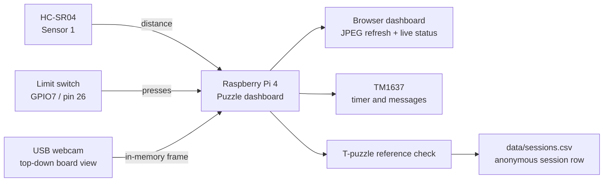
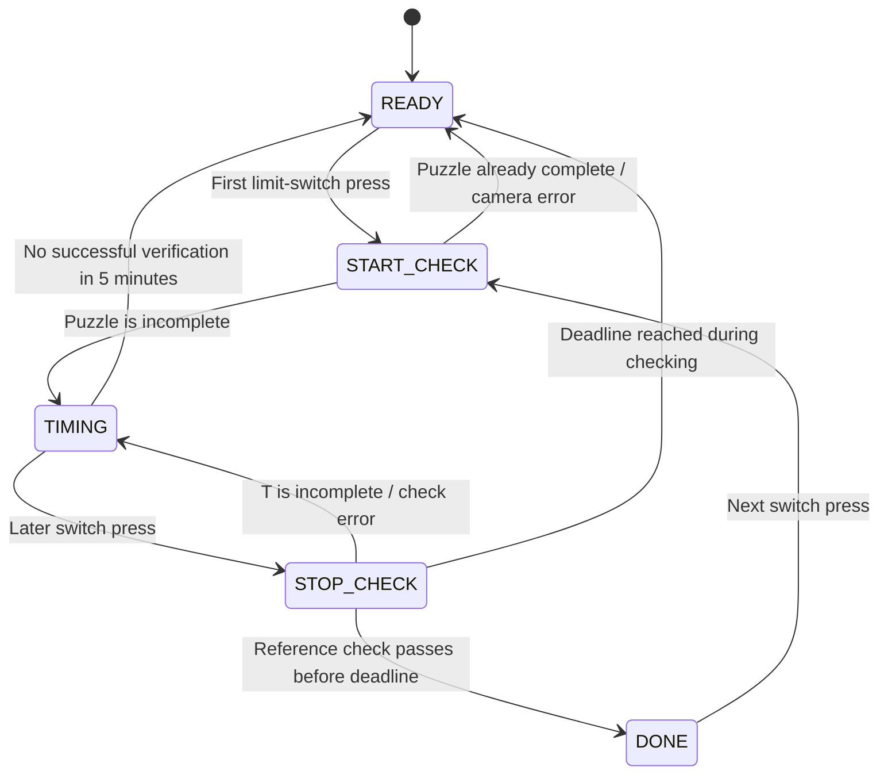
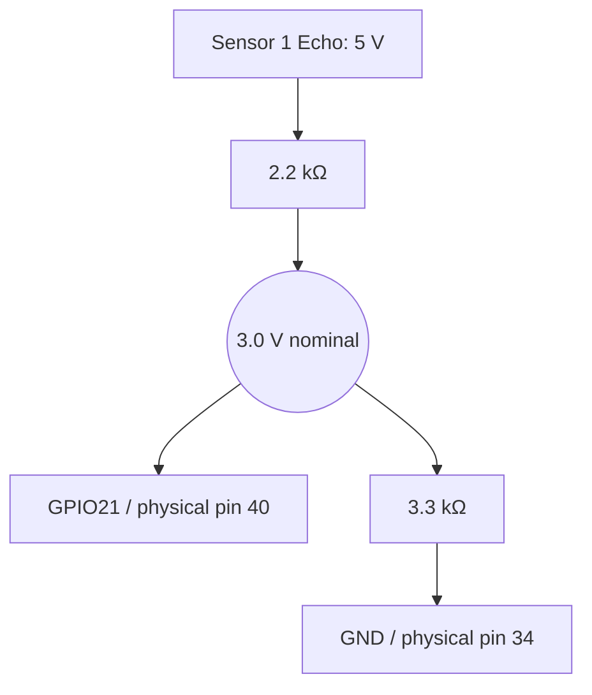

# Puzzle Telemetry Rig

An offline Raspberry Pi system for measuring how visitors solve a physical T-puzzle. It detects an approach, starts and stops a stopwatch with one limit switch, verifies the completed shape from a top-down webcam, and writes anonymous session metrics to CSV.

> The rig serves a live local dashboard but does not record video or per-session photos.

## System at a glance



## Session flow



At the five-minute deadline, the session is saved with `completed=abandoned`. A reference check must finish before the deadline to save `completed=yes`.

## Current wiring

| Component | Pi physical pin | BCM GPIO | Notes |
|---|---:|---:|---|
| Sensor 1 VCC / GND | 4 / 34 | — | 5 V / GND |
| Sensor 1 Trigger | 38 | GPIO20 | Pi to sensor |
| Sensor 1 Echo | 40 | GPIO21 | 2.2 kΩ series; 3.3 kΩ from junction to GND |
| Sensor 2 | — | GPIO6/GPIO27 reserved | Disconnected and disabled |
| Limit switch NO | 26 | GPIO7 | Internal pull-up; pressed = LOW |
| Limit switch COM | 20 | — | GND; NC unused |
| TM1637 VCC / GND | 1 / 6 | — | 3.3 V / GND |
| TM1637 CLK / DIO | 16 / 18 | GPIO23/GPIO24 | Four-digit session display |
| Two-pin LED socket + / − | 1 / 6 | — | + through 330 Ω; always on; no GPIO control |
| Logitech Brio 100 | USB-A | — | `/dev/video0` |



The Echo divider is mandatory: never connect HC-SR04 Echo directly to a Pi GPIO. Pin numbers in code are BCM; wiring positions are physical pin numbers. Sensor 1 distance validation on the new pins is still pending (`out_of_range` at the last check).

Use [wiring.md](docs/wiring.md) for the current wiring and [the September 16 test record](docs/bench-test-2026-09-16.md) for validation status. [architecture.pdf](docs/architecture.pdf) and [current-system-flow.pdf](docs/current-system-flow.pdf) are retained historical snapshots; their old pin assignments do not describe this revision.

## Switch and display feedback

A debounced press enters the recent-event list and asks the session to start or check completion. Release only records an event. Presses during a check/save do not launch another check. Holding the switch does not repeat the action.

The display shows session results: an incomplete stop flashes `NOT DONE` for 2.4 seconds, then returns to the advancing timer. Every completed check increments `feedback_revision`, so repeated identical results replay their notice even when the display misses the brief checking state. The browser preview follows the same renderer. The switch badge shows the current input at approximately 400 ms intervals; the event list retains the last five transitions.

## Completion check

The dashboard stores one solved-T reference during setup. On every start/stop check it uses:

1. HSV colour segmentation for the tan puzzle material.
2. Morphological clean-up and the largest connected component.
3. Contour comparison with OpenCV `matchShapes`.
4. Area-ratio comparison with the solved reference.

This is fixed-camera reference matching, not semantic image recognition. Calibrate thresholds with real complete and incomplete examples under final lighting. See [the visual verification explainer](docs/t-puzzle-verify-algorithm.pdf).

## Metrics collected

| Field | Meaning |
|---|---|
| `session_id` | Anonymous sequential session identifier |
| `approach_ts` | Time sustained proximity was detected |
| `start_ts`, `stop_ts` | Accepted start press and successful stop/timeout timestamps |
| `approach_to_start_s` | Time from approach to accepted start press |
| `solve_time_s` | Elapsed solve time |
| `min_distance_cm` | Closest ultrasonic distance during the recorded approach |
| `completed` | `yes` after a passing reference check, or `abandoned` after five minutes |
| `notes` | Verification scores, detecting sensor(s), and timeout reason |

Current sensor readings and switch events are live-only. `hand_frames_pct`, `frames_total`, and `verify_photo` are reserved schema fields and are currently blank.

## Run on the Pi

The normal runtime is a system service. It starts automatically after the Pi boots or power returns.

```bash
sudo systemctl status puzzle-dashboard.service
sudo systemctl restart puzzle-dashboard.service
sudo journalctl -u puzzle-dashboard.service -n 50 --no-pager
```

To view the dashboard remotely, use the Pi's private Tailscale URL:

<https://puzzle-rig-pi.tail77a689.ts.net/>

The address is available only to approved devices on the Tailscale network. It avoids the temporary Windows SSH tunnel, which is retained only as a diagnostic fallback.

## Privacy and data handling

- Frame the camera on hands and board only; faces must not enter the view.
- No video or per-session board photos are stored.
- The only retained images are the solved-reference photo and mask captured during setup.
- Session identifiers are anonymous. Do not add names, phone numbers, or other personal data.
- `data/` is intentionally excluded from Git.

## Repository layout

```text
src/tools/live_dashboard.py     # Runtime: dashboard + session state machine
src/vision/verify.py            # T-puzzle reference matching
src/sensors/ultrasonic.py       # Sequential, on-demand HC-SR04 pings
src/display/seven_segment.py    # TM1637 driver and session feedback renderer
src/config.yaml                 # Pins and all tunable thresholds
deploy/puzzle-dashboard.service # Pi boot/autorestart service
docs/                            # Wiring, system-flow, and verification diagrams
```

## Status and next work

- [x] Single-sensor config moved to GPIO20/GPIO21; Sensor 2 disabled
- [x] Limit switch on GPIO7 and repeated display notices tested by user (16 Sep 2026)
- [ ] Confirm known-distance HC-SR04 readings on the final soldered wiring
- [x] Live dashboard, approach timing, and five-minute abandonment safety timeout
- [x] T-puzzle reference verification
- [x] Automatic dashboard start after Pi boot
- [ ] Calibrate completion thresholds with labelled real-world checks
- [ ] Hand tracking metrics
- [ ] E-paper display integration
